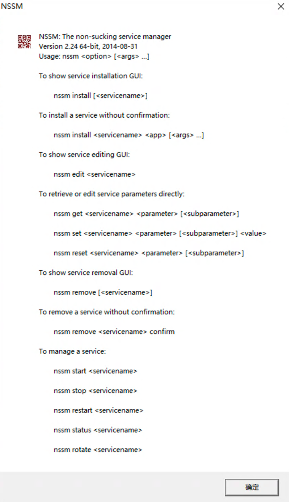
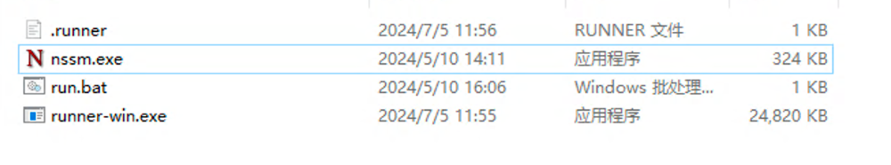
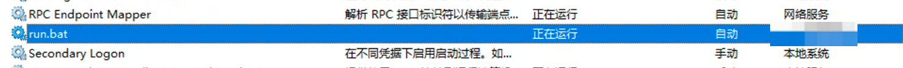
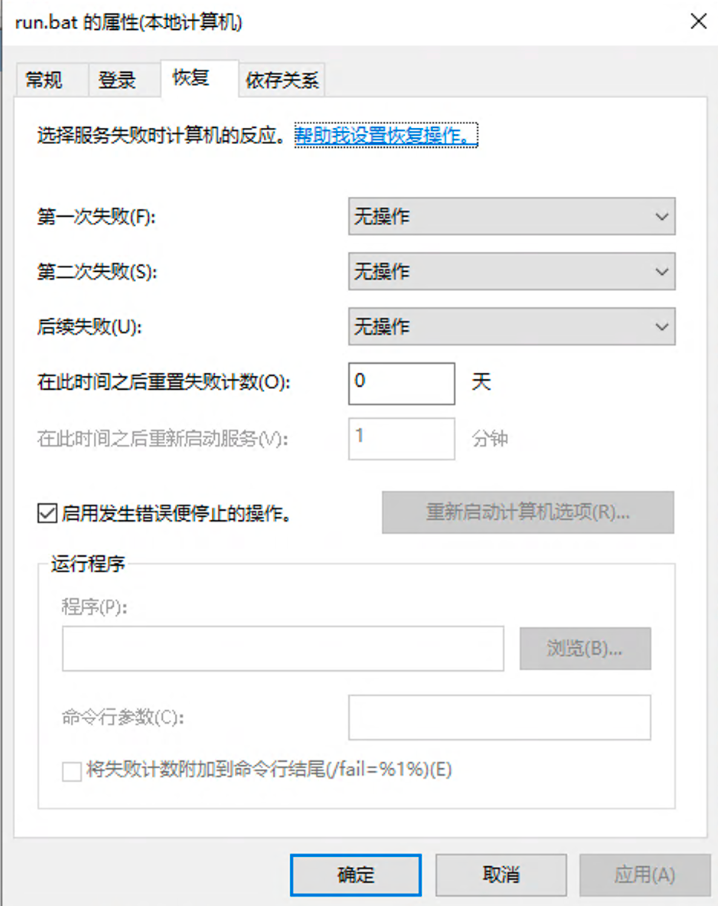

# Runner
> 用于存储pipeline的runner发布release

# 安装 runner 服务

1. 到 https://github.com/tongxinzhiwu/runner/releases 下载对应平台的 runner
2. 检查校验和，例如 linux-amd64 的：`echo "$(cat runner-linux-amd64.sha256)  runner-linux-amd64" | shasum -a 256 -c -`
3. 在平台上添加运行器，注册token：https://efficacy.makeblock.com/#/cicd/runner
4. 执行注册命令，注册完成会在当前目录下生成 `.runner` 文件：
> runner register --name={runnerName} --instance=https://pipeline.makeblock.com --labels=label1,label2 --token=ac69207dcfc6443381fcc7ac5a294f65
- 这里的name和token需要替换成自己的，
- labels可以自定义，后期任务的执行可以通过选择label来分配到指定runner去执行，
- instance是服务端的地址


## 启动 Runner 服务（必须先完成注册）

### Linux

> linux下可以使用systemd来创建服务: https://systemd.io/

Systemd service 方式启动

```bash
[Unit]
Description=runner
Documentation=https://git.makeblock.com/makeblock-devops/pipeline

[Service]
ExecStart=/home/makeblock/devops/runner-linux-amd64 run
ExecReload=/bin/kill -s HUP $MAINPID
WorkingDirectory=/var/lib/runner
TimeoutSec=0
RestartSec=10
Restart=always
User=root
Environment="CAPACITY=12" # 设置runner的并发执行任务数
Environment="REPORT_METRIC=false" # 是否上报metric(非核心runner可以不用上报)

[Install]
WantedBy=multi-user.target
```

启动服务

```bash
# load the new systemd unit file
sudo systemctl daemon-reload
# start the service and enable it at boot
sudo systemctl enable runner --now

# We have all the pieces we need to enable and start the service
systemctl enable runner.service
systemctl start runner.service

# Check the status of the service and logs
systemctl status runner.service
journalctl -e -u runner.service
```

### Mac

> mac下使用launchctl来创建服务：https://www.launchd.info/

创建文件

```text
/Library/LaunchAgents/com.makeblock.pipeline.runner.plist
```

> 将下面的内容复制到文件中，注意修改二进制可执行文件路径成自己的 

```xml
<?xml version="1.0" encoding="UTF-8"?>
<!DOCTYPE plist PUBLIC "-//Apple//DTD PLIST 1.0//EN" "http://www.apple.com/DTDs/PropertyList-1.0.dtd">
<plist version="1.0">
<dict>
    <key>Label</key>
    <string>com.makeblock.pipeline.runner</string>
    <key>UserName</key>
    <string>makeblock</string>
    <key>RunAtLoad</key>
    <true/>
    <key>KeepAlive</key>
    <true/>
    <key>ProgramArguments</key>
    <array>
        <string>/Users/makeblock/pipeline/runner/runner-osx-arm64</string>
        <string>run</string>
    </array>
    <key>StandardOutPath</key>
    <string>/Users/makeblock/pipeline/runner/stdout.log</string>
    <key>StandardErrorPath</key>
    <string>/Users/makeblock/pipeline/runner/error.log</string>
    <key>EnvironmentVariables</key>
    <dict>
        <key>CAPACITY</key>
        <integer>2</integer>
        <key>REPORT_METRIC</key>
        <string>true</string>
    </dict>
</dict>
</plist>
```

```bash
sudo launchctl load -w /Library/LaunchAgents/com.makeblock.pipeline.runner.plist
launchctl list | grep runner
```

### Windows

创建一个bat文件，注意根据自己的环境修改可执行文件的路径，内容如下：

创建 runner.bat 文件

```bat
@echo off
setlocal

set "EXE_PATH=.\runner-win.exe"
if not exist "%EXE_PATH%" (
    echo "runner-win.exe 文件不存在。请确保它位于当前目录下。"
    exit /b 1
)

"%EXE_PATH%" run

endlocal
```

> windows下可以使用nssm或者sc来创建服务（实现服务的自启），需要先下载安装：https://nssm.cc/download/

使用 nssm 创建服务


```shell
1. 安装服务：nssm install 服务名称
2. 删除服务：nssm remove 服务名称
3. 删除服务确定：nssm remove 服务名称 confirm
4. 修改服务（显示界面修改）：nssm edit 服务名称
5. 启动服务：nssm start 服务名称
6. 停止服务：nssm stop 服务名名称
7. 停止服务：nssm stop 服务名称
```
exmaple:



```shell
1. 在当前路径进入cmd控制台 
nssm start run.bat

2. 即可看到服务已经启动在系统管理后台，如上图所示

3. 也可配置失败自启动信息，如上图所示

```


```shell
sc create RunnerService binPath= "C:\path\to\your\runner.bat"
sc config RunnerService start=auto
sc start RunnerService
sc stop RunnerService
```

